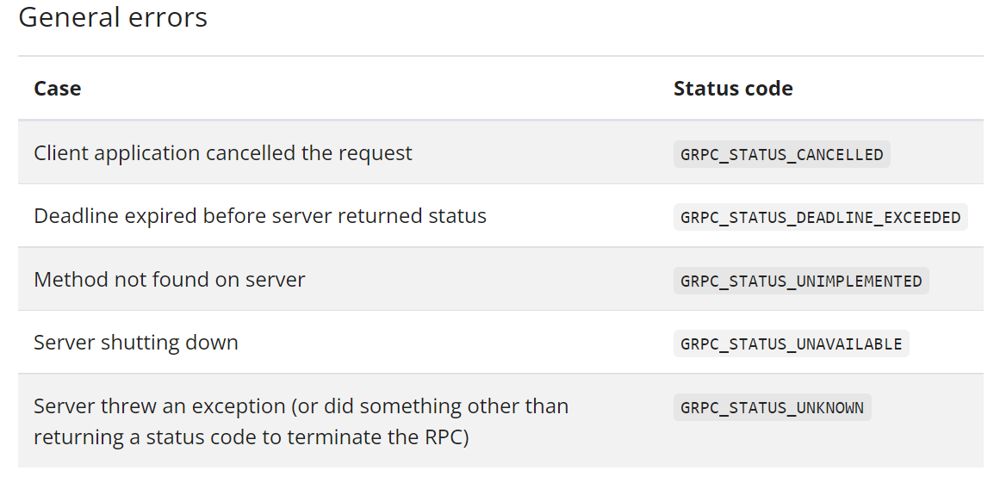
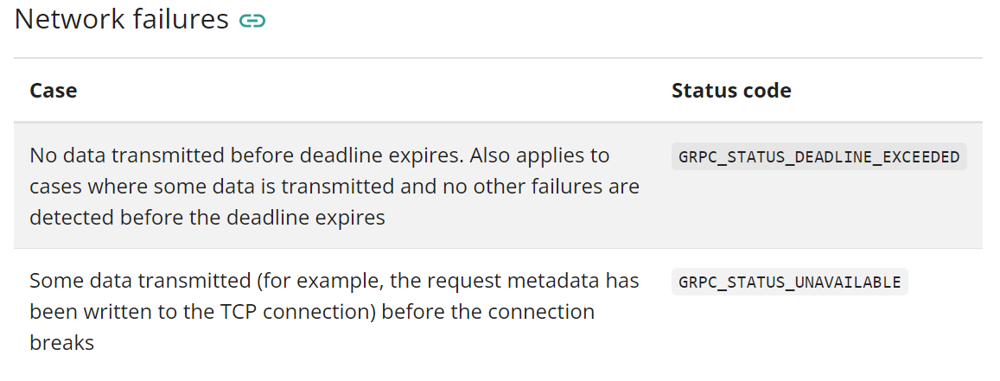
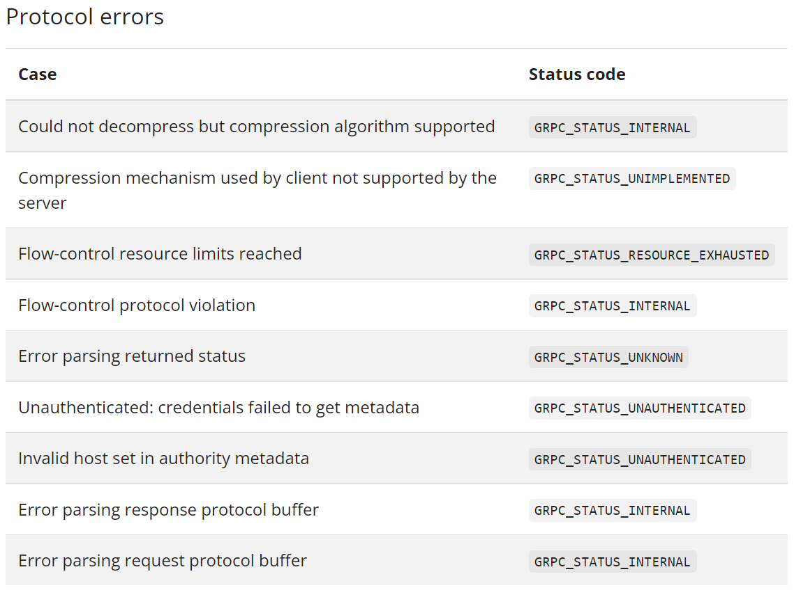

# gRPC Golang Master Class

section 09 gRPC Advanced Features Deep Dive

### Errors in gRPC

#### Error Codes

- It is common for API to sometimes return error code

- Http has many error codes

- While HTTP codes are standardized they're not usually clear

- gRPC has a few error codes

  - [grpc 공식 문서 error](https://www.grpc.io/docs/guides/error/)
  - [golang grpc error](https://avi.im/grpc-errors/#go)

  

  

  

### Client

```go
func doErrorCall(c calculatorpb.CalculatorServiceClient, n int64) {
	response, err := c.SquareRoot(
		context.Background(),
		&calculatorpb.SquareRootRequest{Number: n})
	if err != nil {
		respErr, ok := status.FromError(err)
		if ok {
			// actual error from gRPC (user error)
			log.Println(respErr.Message())
			log.Println(respErr.Code())
			if respErr.Code() == codes.InvalidArgument {
				log.Println("Negative Number Error")
				return
			}
		} else {
			// severe error
			log.Fatalf("Severe Error calling SquareRoot: %v", err)
			return
		}
	}
	log.Printf("Result of square root of %v : %v\n", n, response.GetResult())
}
```


### Server 

```go
	if number < 0 {
		return nil, status.Errorf(
			codes.InvalidArgument, fmt.Sprintf("Received a negative number %v", number))
	}
```


